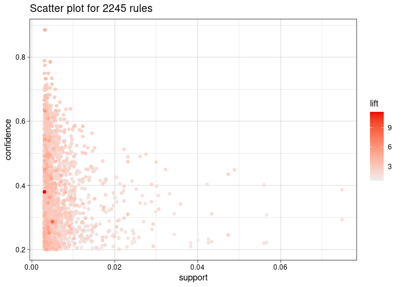
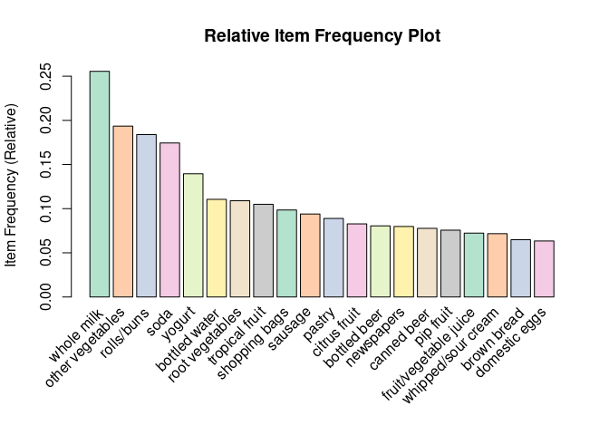

HW4
================
2023-04-15

## Question 3

For this rule selection, I set the minimum support to 0.003, minimum
confidence to 0.2, and minimum length of the rules to 2. These
thresholds were chosen based on trial and error to find a good balance
between the number of rules generated and their interestingness. Some of
the interesting associations that we see are people who buy instant food
products are more likely to buy hamburger meat, people who buy flour are
more likely to buy sugar, and people who buy processed cheese are more
likely to buy white bread. These rules all make sense - baking, sandwich
making, easy meals, etc. The relative frequency plots as well as
association plots and top 5 association rules are shown below.

|       | lhs                     |     | rhs                |   support | confidence |  coverage |      lift | count |
|:------|:------------------------|:----|:-------------------|----------:|-----------:|----------:|----------:|------:|
| \[1\] | {Instant food products} | =\> | {hamburger meat}   | 0.0030503 |  0.3797468 | 0.0080325 | 11.421438 |    30 |
| \[2\] | {liquor}                | =\> | {bottled beer}     | 0.0046772 |  0.4220183 | 0.0110829 |  5.240594 |    46 |
| \[3\] | {cereals}               | =\> | {whole milk}       | 0.0036604 |  0.6428571 | 0.0056940 |  2.515917 |    36 |
| \[4\] | {soups}                 | =\> | {other vegetables} | 0.0031520 |  0.4626866 | 0.0068124 |  2.391236 |    31 |
| \[5\] | {candles}               | =\> | {whole milk}       | 0.0030503 |  0.3409091 | 0.0089476 |  1.334199 |    30 |

<!-- --><!-- -->
