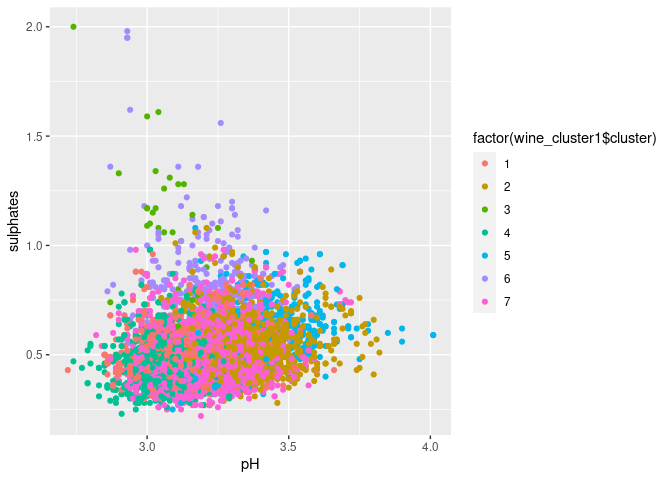

HW4c
================
2023-04-17

# Question 1

## PCA

The two graphs below represent the PCA analysis of the wine data. The
PCA algorithm had little trouble distinguishing between the two “colors”
of the wines, as can be easily seen from the first graph.

However, the PCA had difficulties with determining quality of the wine,
as determinied by the wine snobs. On further thought that conclusion
should not be surprising, since wine quality is extremely subjective,
and if there existed such deterministic formula that creates high
quality wine, it would very easily replicated. Such is not the case.

<!-- --><!-- -->

## Clustering Analysis

Clustering analysis did not provide any useful results. Below is a plot
of the K-means algorithm, with k=2 andk=7, in hopes that it would be
able to break down the data either by color (red or white) or quality
(3-9). However, as the graphs below suggeset no appropriate clustering
took place, which after doing some research isn’t surprising, as none of
the chemical properties of the data aren’t actually indicative of grape
color on their own. As for quality, similarily to the PCA analysis, it
appears that chemical composition (that is provided by the data) isn’t
deterministic of the determined quality.

Note. I ended up choosing pH and sulphates as my variables after some
trial and error playing with other variables. No other combination
provided any significant visual distinctions in the types of wine.

<!-- --><!-- -->

# Question 2

Here we attempt to find market segments for the company by finding
correlations between the topic of user’s twitter posts. We construct a
graph showing an edge between two topics if the topics have correlation
greater than 0.25:

<!-- -->

We can distinctly see 7 different groups of correlated user interests.

Group 1 - Adults with kids (School, Food, Family, Parenting, Religion,
Sports Fandom)

Given the topics of school, parenting and family it is reasonable to
assume that this segment is comprised of people who either have children
or want children. Family friendly messaging is likely likely important
for this segment. The sports fandom interest also suggests it may be
disproportionately male.

Group 2 - Current Events (Politics, Travel, Computers, News, Automotive)

Politics is the center of this network and is correlated with all other
members. This market segment also seems to keep up with world trends in
culture and technology following the news, travel and computers.
Corporate messaging that is current and relevant would be best for this
group.

Group 3 - Aesthetically Oriented (Beauty, Fashion, Cooking, Photo
Sharing, Shopping, Chatter)

This market segment is likely highly keen on the image with interests in
beauty, shopping, photo sharing and fashion. There is also a chance this
segment is disproportionately female.

Group 4 - Creatives (Art, TV_fim, Music)

Here we have individuals who might appreciate uniqe and original
marketing with an artistic bent.

Group 5 - College Men (Sports_playing, online_gaming, college_uni)

This segment seems to be largely comprised of young men, historically
advertisement using attractive women has been targeted for this group.

Group 6 - Health (health_nutrition, personal_fitness, outdoors)

This group is very active and concerned with personal health, any health
features of the drink should be highlighted for this group.

Group 7 - Bots (Spam, Adult)

These are likely not real followers.

# Question 3

For this rule selection, I set the minimum support to 0.003, minimum
confidence to 0.2, and minimum length of the rules to 2. These
thresholds were chosen based on trial and error to find a good balance
between the number of rules generated and their interestingness. Some of
the interesting associations that we see are people who buy instant food
products are more likely to buy hamburger meat, people who buy flour are
more likely to buy sugar, and people who buy processed cheese are more
likely to buy white bread. These rules all make sense - baking, sandwich
making, easy meals, etc. The relative frequency plots as well as
association plots are shown below.

<!-- --><!-- -->
